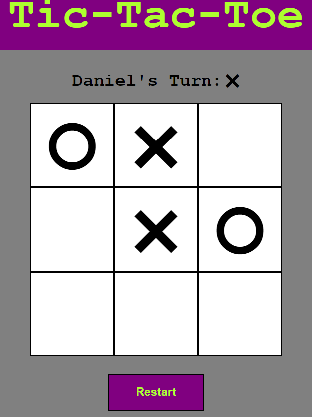

# Tic-Tac-Toe
## Link: https://anthonylombardo321.github.io/Tic-Tac-Toe/

    

## Features
* Modals:
    * Game Mode (Select Game Mode)
    * Form (Add Names to Player Objects)
    * Game Over (Display Game Over Message)
* Buttons:
  * Restart (Restart Current Game)
  * Play Again (Play the sa)
  * New Game (Select New Game Mode).
* Game Modes:
  * Player vs. Player
  * Player vs. AI
  * AI vs. AI

## What I Learned:
* How to use factory functions to create player objects
* How to use modules to contain variables and methods inside a given scope.
* How to display modals and manipulate them through JS
* How to create a basic AI
* How to use array functions to write less code when checking if a player won
* How to make asynchronous calls (setTimeout) run sequentially with a flag variable